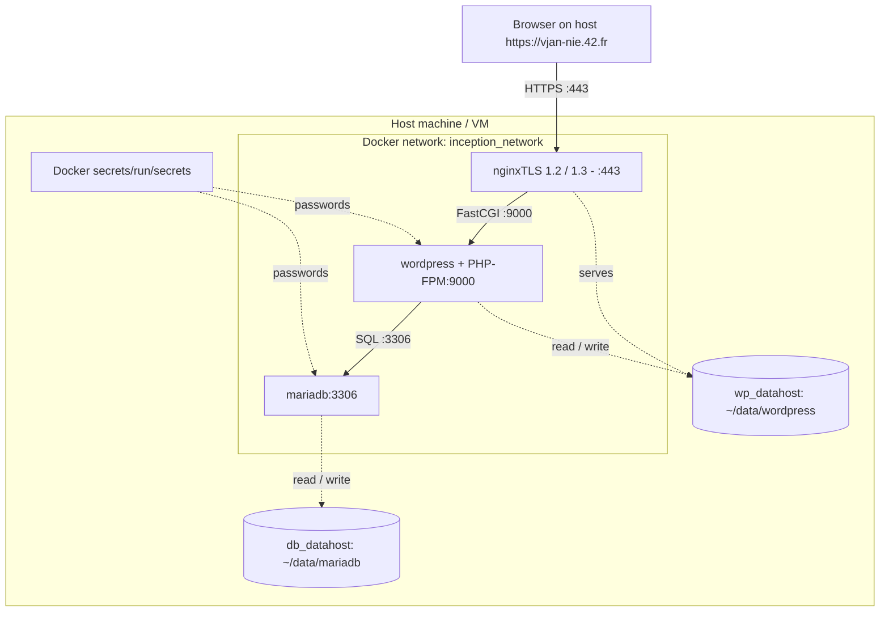

*This project has been created as part of the 42 curriculum by vjan-nie.*

# Inception

## Description

**Inception** is a System Administration project from the 42 curriculum, built to deepen understanding of virtualization and infrastructure-as-code using **Docker**. It sets up a small LEMP-like stack where each service — **NGINX**, **WordPress + PHP-FPM** and **MariaDB** — runs in its own container, built from a hand-written Dockerfile. The containers talk to each other over a private Docker network, persist their data through host bind mounts, and are reachable from the outside world only through NGINX over TLS on port 443.

> **📖 How it works** — see **[GUIDE.md](GUIDE.md)**: a walkthrough of the stack and how each piece maps to production infrastructure.



> The browser is the only thing that crosses into the stack, and only over TLS on port 443.
> The containers talk on a private network; data lives in host bind mounts; passwords are injected as Docker secrets.

> Runs inside a Debian VM — provisioning automated in [Debian_VM](https://github.com/vjan-nie/Debian_VM).


## Project description & design choices

The whole stack is orchestrated from the `srcs/` directory:

- `docker-compose.yml` — services, private network, volumes and secrets
- `requirements/<service>/` — one Dockerfile, configuration and entrypoint per service
- `.env` — non-sensitive environment variables (git-ignored; see *Environment & secrets*)
- `secrets/` — passwords handled as Docker secrets (real `*.txt` git-ignored; `*.txt.example` templates tracked)

Every image is built locally from **Alpine 3.22** (no pre-built application images are pulled), each service is a single container running its process as **PID 1** (no `tail -f` / `sleep infinity` hacks), and `restart: unless-stopped` brings any crashed container back up.

| Concept | Choice | Reasoning |
| :--- | :--- | :--- |
| VMs vs Docker | Docker | A VM virtualizes a whole machine/OS (heavy); a container isolates a single service with far less overhead and faster startup. |
| Secrets vs Environment Variables | Docker secrets for passwords | Env vars leak through `docker inspect`, `/proc/<pid>/environ` and child processes. Secrets are mounted read-only at `/run/secrets/` and stay out of the image layers, the process environment and Git. Only non-sensitive values (domain, DB/user names, titles) remain in `.env`. |
| Docker Network vs Host Network | Custom bridge network | Isolates inter-container traffic on a private network. Host networking would expose every service directly and break the "only NGINX on 443" requirement (`network: host` and `--link` are forbidden by the subject). |
| Docker Volumes vs Bind Mounts | Bind mounts | Data lives under `/home/<login>/data`, so it is visible and inspectable on the host during evaluation. |

## Instructions

### 1. Prerequisites

- Linux with **Docker** and **Docker Compose v2**
- `sudo`, or membership in the `docker` group (host folders under `/home/<login>/data` and some `make` targets need it)

### 2. Host configuration

Point the project domain to the loopback address:

```bash
echo "127.0.0.1 vjan-nie.42.fr" | sudo tee -a /etc/hosts
```

### 3. Environment & secrets

Non-sensitive variables live in `srcs/.env`; passwords live in `secrets/*.txt`. Running `make` bootstraps **both** from their committed `*.example` templates when they are missing — **edit them with your own values afterwards.**

`.env` template (no passwords here):

```ini
LOGIN=vjan-nie
DOMAIN_NAME=vjan-nie.42.fr

# MariaDB
MYSQL_DATABASE=wordpress
MYSQL_USER=wpuser

# WordPress
WP_TITLE=My Inception Site
WP_ADMIN_USER=vjan-nie_boss          # must NOT contain "admin"
WP_ADMIN_EMAIL=boss@student.42madrid.com
WP_USER=vjan-nie_guest
WP_USER_EMAIL=guest@student.42madrid.com
```

Secrets — one password per file (the real `*.txt` are git-ignored):

```
secrets/db_root_password.txt
secrets/db_password.txt
secrets/wp_admin_password.txt
secrets/wp_user_password.txt
```

To reproduce the project with your own credentials, copy each template and replace the placeholder:

```bash
for f in secrets/*.txt.example; do cp "$f" "${f%.example}"; done
$EDITOR secrets/*.txt          # put your real passwords here; they never reach Git
```

### 4. Build & run

```bash
sudo make all      # build the images and start the stack
sudo make down     # stop the stack
sudo make fclean   # remove containers, images, volumes and host data
```

Then open **https://vjan-nie.42.fr**. The certificate is self-signed, so accept the browser warning when testing locally.

## Resources

- Docker & Docker Compose documentation — https://docs.docker.com
- Using secrets in Compose — https://docs.docker.com/compose/
- NGINX documentation — https://nginx.org/en/docs/
- MariaDB Knowledge Base — https://mariadb.com/kb/en/
- WP-CLI handbook — https://make.wordpress.org/cli/handbook/
- Dockerfile best practices & PID 1 — https://docs.docker.com/build/building/best-practices/

### AI usage

AI assistants were used as collaborative tools, with every change reviewed and understood before committing:

- **Auditing & code review** (Claude): critical audit of the stack and adversarial review of each change before merge.
- **Secrets migration** (Claude Code): moving the DB and WordPress passwords from `.env` to Docker secrets across `docker-compose.yml`, the entrypoints, the `Makefile` and `.gitignore`.
- **Base image upgrade** (Claude Code): Alpine 3.18 → 3.22 and PHP 8.1 → 8.3 in the WordPress image.
- **Documentation** (Claude, Gemini, Copilot): drafting and refining this README and the project docs for subject compliance.

## Authors

vjan-nie — 42 Curriculum
